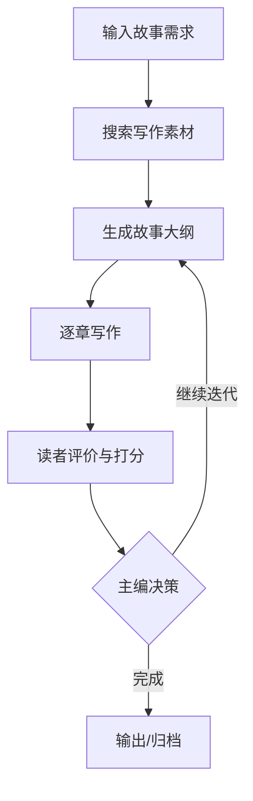

# AI故事生成器产品需求说明书（PRD）

---

## 1. 文档信息
- **文档版本**：v0.1（草案）
- **创建日期**：2025-08-09
- **作者/Owner**：daoyu
- **评审人**：产品/研发/设计/测试/运营
- **状态**：草拟中｜评审中｜已评审｜开发中｜已发布
- **变更记录**：
  - v0.1 2025-08-09：首次创建

## 2. 背景与目标
- **背景**：
  - 家长与中小学生在阅读动机、选书质量、陪伴时间上存在持续痛点；传统阅读APP缺乏“个性化内容+可交互反馈”的闭环，难以持续提升孩子的阅读兴趣与心理健康。
  - 大模型生成能力与Agent编排成熟，可构建“根据读者反馈持续优化内容”的多Agent故事生产与阅读服务。
  - 竞品：通用阅读APP（弱个性化）、写作AI工具（缺阅读闭环）、教育测评工具（缺内容生成）。
- **产品目标（可量化）**（MVP周期内）：
  - 阅读兴趣：7日内人均有效阅读时长≥40分钟，≥65%的K12用户完成至少2次完整阅读会话。
  - 满意度：读者会话满意度≥8.2/10（读者Agent量表+主观打分）；家长端满意度≥8.0/10。
  - 学习与疗愈：读后测评（记忆/专注/理解）有效完成率≥60%，专注力平均提升（同题型A/B）≥10%。
  - 生成质量：平均迭代≤2.5次达到评分≥9/10；拒绝/安全拦截率<1%。
- **范围与非目标**：
  - 范围（MVP）：
    - 多Agent故事生成（大纲/写作/读者/主编）
    - 多模态阅读服务（文本+配图+基础TTS音频）
    - 读者互动反馈、家长端主题与模板配置
    - 阅读行为采集与分析Agent，读后简易测评
  - 非目标（MVP之外）：
    - 完整视频动画生产、版权级图像生成；多人协作课堂；线下硬件适配

## 3. 术语与角色
- **术语**：LLM、Agent、Prompt、章节、评分、迭代 等
- **用户角色**：
  - 家长（监护人）：配置阅读主题/字数/模板，查看进度与效果
  - 中小学生读者：沉浸式阅读、互动反馈、完成读后测评
  - 普通阅读爱好者：个性化故事/小说/散文/作文生成与阅读
  - 多Agent（系统角色）：
    - 大纲Agent/写作Agent：内容生产
    - 读者Agent：自动评价与建议生成（辅助）
    - 主编Agent：是否继续迭代与修改指引
    - 分析Agent：阅读喜好、专注点、潜在心理问题提示

## 4. 用户画像与场景
- **画像**：
  - K12 学生：6–18 岁，手机/平板为主；每次10–30分钟碎片化阅读
  - 家长：30–45 岁，重视心理健康与学习效果，可配置与监督
  - 阅读爱好者：18+，追求个性化与互动体验
- **关键场景（Scenario）**：
  1. 孩子开启阅读 → 系统根据画像与当次情绪/偏好生成故事 → 互动反馈 → 读者/主编Agent触发迭代 → 连续两章评分≥9 → 完成读后测评
  2. 家长设置主题“校园治愈/友情”，设字数2k，每晚提醒20:30 → 生成多模态阅读页 → 监控时长/专注 → 查看分析报告
  3. 阅读中孩子提问“为什么主角害怕？”→ 系统解释并轻量心理疏导提示（基于教育心理学与已知真实知识）
- **用户旅程**：拉新（口碑/校园）→ 体验（1次完整会话）→ 留存（个性化推荐）→ 付费（高级模板/深度分析）
- **用户旅程（可选）**：认知 → 试用 → 留存 → 付费/扩散

## 5. 需求列表（分级与优先级）
- **优先级定义**：
  - P0：必须（无此不可上线）
  - P1：重要（尽量本期，必要时下期）
  - P2：可选（锦上添花）
- **需求表**：

| ID | 标题 | 描述 | 角色 | 优先级 | 依赖 | 备注 |
|---|---|---|---|---|---|---|
| FR-001 | 创建故事需求 | 输入类型/主题/字数/章节/读者画像 | 家长/读者 | P0 | 无 | 表单校验 |
| FR-002 | 生成故事大纲 | 基于LLM与素材生成结构化大纲 | 系统 | P0 | FR-001 | 底线设计合规 |
| FR-003 | 按章写作 | 根据大纲逐章生成并入库 | 系统 | P0 | FR-002 | 版本化存储 |
| FR-004 | 阅读服务（多模态） | 文本+配图+TTS音频播放 | 读者 | P0 | FR-003 | 可选视频占位 |
| FR-005 | 互动反馈 | 点评/打分/困惑点/喜欢点收集 | 读者 | P0 | FR-004 | 会话内实时生效 |
| FR-006 | 主编决策迭代 | 依据读者与读者Agent评价再写 | 系统 | P0 | FR-005 | 评分≥9或达上限止 |
| FR-007 | 家长控制台 | 调整主题/字数/模板与时段提醒 | 家长 | P0 | FR-001 | 家长密码/家长码 |
| FR-008 | 分析Agent | 阅读喜好/专注点/停留/翻页分析 | 系统 | P1 | FR-004 | 隐私合规聚合 |
| FR-009 | 读后测评 | 记忆/专注/理解力测评与报告 | 读者 | P1 | FR-004 | 题库可配置 |
| FR-010 | 导出/分享 | 导出Markdown/链接 | 家长/读者 | P1 | FR-003 | 去敏处理 |
| FR-011 | 安全合规模块 | 敏感话题拦截/年龄分级/出处校验 | 系统 | P0 | 全局 | 日志留痕 |

## 6. 用户故事（User Stories）
- 作为家长，我想为孩子设定“治愈系校园主题”和字数，孩子能获得更贴合的故事并愿意读完。
- 作为学生，我在阅读时可以随时反馈困惑与喜好，从而系统能快速调整下一章内容。
- 作为学生，我希望在结尾做一个轻量测评，了解我的记忆/专注/理解情况。
- 作为家长，我希望查看阅读时长与专注度报告，及时调整主题与时段。

## 7. 用例与流程
### 7.1 用例（核心）
- UC-01 创建故事需求：前置条件、主成功路径、备选路径、异常路径
- UC-02 生成大纲
- UC-03 生成章节
- UC-04 阅读服务与互动反馈（页面停留、翻页、打分、留言）
- UC-05 主编决策与再次迭代
- UC-06 读后测评与报告生成

### 7.2 交互流程/状态机（示意）
- 高层流程：需求 → 搜索素材 → 大纲 → 章节 → 评价 → 决策 → 结束/继续
- 可附：流程图、泳道图、状态图（Mermaid/截图占位）

## 8. 交互与信息架构（IxD/IA）
- **信息架构**：
  - 阅读端：故事阅读页（文本/配图/TTS/互动区）、测评页、结果页
  - 家长端：配置页、报表页（阅读/测评）、提醒与权限
  - 创作端（内部）：生产监控、内容审核、版本与评分
- **关键页面原型要点**：
  - 阅读页：字号/行距/夜间、播放/暂停、进度、互动反馈入口
  - 报表页：日/周/月时长、专注热力图、偏好主题词云
- **无障碍与国际化（可选）**：字体、对比度、快捷键、语种

## 9. 业务规则与校验
- 表单校验：必填、类型、长度、范围（如字数>0 且 ≤ 上限）
- 配额/限流：每日生成次数、并发限制
- 评分规则：1–10 分；≥9分停止迭代；最大N次迭代
- 重试与回滚：生成失败的恢复策略
- 日志与审计：关键操作留痕
 - 底线设计：
   - 坚持基于已知真实知识与教育心理学、文学创作理论；涉及事实类内容需有可追溯出处（或不生成）。
   - 年龄分级与敏感内容拦截（暴力、色情、歧视、自残等）
   - 心理建议仅作科普与引导，出现高风险信号提示家长与求助资源，不替代专业诊疗。

## 10. 数据与接口
### 10.1 数据模型（示例）
- 故事要求：`story_type`, `theme`, `word_count`, `chapters`, `target_reader`, `status`
- 大纲：`requirement_id`, `version`, `outline_content`
- 章节：`requirement_id`, `outline_id`, `version`, `chapter_number`, `title`, `content`, `word_count`
- 读者反馈：`requirement_id`, `version`, `score`, `evaluation`, `suggestions`
 - 用户画像：`user_id`, `age_range`, `grade`, `interests`, `reading_level`
 - 阅读事件：`session_id`, `events[{type, ts, meta}]`（停留/翻页/打分/评论）
 - 偏好/画像更新：`user_id`, `pref_vector`, `last_updated`
 - 测评结果：`user_id`, `session_id`, `memory_score`, `attention_score`, `comprehension_score`, `scale_version`

> 可附：ER 图/表结构、字段约束、索引策略、数据留存周期

### 10.2 外部接口（如有）
- LLM 服务：供应商/模型、QPS、超时、重试、错误码
- 素材搜索：来源、限额、缓存策略

### 10.3 内部接口（API 草案）
- POST /api/story/requirements
- POST /api/story/outline
- POST /api/story/chapters
- POST /api/story/feedback
- GET  /api/story/:id
 - GET  /api/parents/dashboard
 - POST /api/assessment/submit

---

## 11. 验收标准（Acceptance Criteria）
> 使用 Gherkin 风格提高清晰度
- 场景：创建故事需求
  - Given 我已填写必填项
  - When 我点击“创建”
  - Then 成功创建并进入大纲生成流程
- 场景：评分≥9自动结束
  - Given 已完成至少一次评价
  - When 评分≥9
  - Then 流程进入“保存最终故事”，并导出文件
- 场景：家长配置与限制
  - Given 家长已登录并完成监护校验
  - When 设置阅读时段/字数/模板
  - Then 在下一次会话生效，并在报表中可见
- 场景：高风险内容拦截
  - Given 生成命中敏感规则
  - When 系统判定风险
  - Then 直接拦截并提示替代方案与家长确认

## 12. 指标与埋点（Analytics）
- **核心指标**：
  - 使用：注册转化率、7日留存、会话平均时长、章节完读率
  - 生成：平均迭代次数、≥9分达成率、被拦截率
  - 学习：测评完成率、专注/理解提升（同题型A/B）
  - 满意度：读者/家长满意度（≥8/10）
- **埋点清单**：页面曝光/点击、接口成功/失败、生成耗时
- **A/B 实验**：实验目标、指标、样本量、实验时长

## 13. 非功能需求（NFR）
- **性能**：P95 响应 < X s、单次生成 < Y s、并发量
- **稳定性**：错误率 < Z%、降级策略、重试/补偿
- **安全/隐私**：鉴权、速率限制、敏感词过滤、脱敏、合规（GDPR/本地法规）
- **可用性**：易用性评分、引导/空状态/错误提示
- **可运维性**：日志、监控、告警、开关（Feature Flag）
 - **时延体验（阅读端）**：翻页<200ms，TTS首包<800ms，首屏渲染<1.5s

## 14. 上线策略与版本规划
- **里程碑（Scrum）**：5个迭代完成MVP，10个迭代完善细节，达商用级
  - Sprint 1–2：最小闭环（大纲/写作/阅读/基本互动）
  - Sprint 3：读者Agent评价与主编决策；家长配置
  - Sprint 4：TTS与配图、多端适配、数据采集
  - Sprint 5（MVP验收）：测评、报表、合规与拦截
  - Sprint 6–10：算法与体验优化、深度分析、模板商城、稳定性
- **灰度/回滚**：范围、判定阈值、回滚流程
- **发布清单**：变更点、数据迁移、开关位、配置项
- **依赖与前置条件**：模型额度、第三方配额、证书/域名

## 15. 资源与分工
- **RACI**：
  - Responsible（执行）：研发A/测试B/设计C
  - Accountable（负责）：产品Owner
  - Consulted（协作）：运营/法务/安全
  - Informed（知会）：管理层/销售
- **人力预估**：
前端x人天、后端x人天、模型x人天、测试x人天

---

## 16. 風险与问题清单
- **已识别风险**：
  - 模型幻觉/不实内容；心理建议误导；版权与素材合规；成本与延迟；青少年安全
- **缓解方案**：
  - 多供应商与提示词约束、事实性检索与引用；高风险策略树；内容审核；缓存与分级模型；家长/青少年保护策略
- **Open Issues**：
  - OI-01：评分阈值是否因读者类型而异？
  - OI-02：是否支持多语言生成？

---

## 17. 附录
- 竞品与参考：竞品A/B/C、最佳实践链接
- 原型/设计稿：Figma 链接（占位）
- 接口文档：Swagger/Postman 链接（占位）
- 变更对比：与上一版本差异点

---

> 注：本模板覆盖“为什么、为谁、做什么、怎么做、如何验收与发布”的完整链路。按需删改以贴合你的团队流程。

